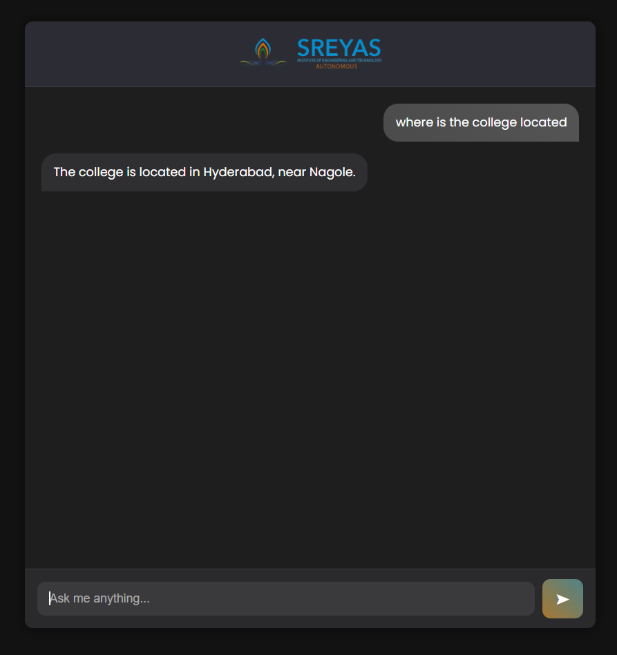

# 🎓 SreyasBot – College Chatbot for Sreyas Institute

**SreyasBot** is a smart chatbot built using Python and Flask to help students and visitors get quick answers about Sreyas Institute of Engineering and Technology, Hyderabad.

👉 [Live Demo](https://sreyas-chat-bot.onrender.com/) ← *(replace with your Render URL)*

---

## ✨ Features

- 🏫 Answers about college location, timings, departments, and staff
- 🧑‍🏫 Lists all department HODs
- 🧾 Provides internal marks & exam info based on R22 regulation
- 📚 Covers facilities like Wi-Fi, library, labs, transportation
- 🛎 Helps with student support like ID cards, login issues
- 🧠 Built with Python’s `re` module for pattern-matching logic
- 💬 Interactive chatbot frontend using HTML, CSS, JS

---

## 📸 Screenshot



---

## 🔧 Tech Stack

- Python 🐍
- Flask 🌐
- HTML/CSS/JavaScript 💬
- Regex-based NLP 🤖
- Deployed via Render ☁️

---

## 🚀 How to Run Locally

```bash
git clone https://github.com/your-username/sreyas-chatbot.git
cd sreyas-chatbot
pip install -r requirements.txt
python app.py


Folder structure

college-chatbot/
├── chatbot.py           # Core bot logic
├── app.py               # Flask backend
├── requirements.txt     # Dependencies
├── templates/
│   └── index.html       # Chat UI
└── static/
    └── style.css        # Styling


Example Questions
"Who is the principal?"
"Where is the college located?"
"What is the lunch break time?"
"Tell me about departments"
"How do I check my results?"
"Is hostel available?"


Made by Surya U, an engineering student at Sreyas Institute.
This project is built for learning, contribution, and placement portfolio purposes.


🌐 Links
🔗 College Website

🔗 Contact College

🔗 Results Portal


---

  - `https://sreyas-chat-bot.onrender.com/` **Render live URL**
  - `https://github.com/surya446/AI-chatbot-for-college-queries`
